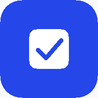
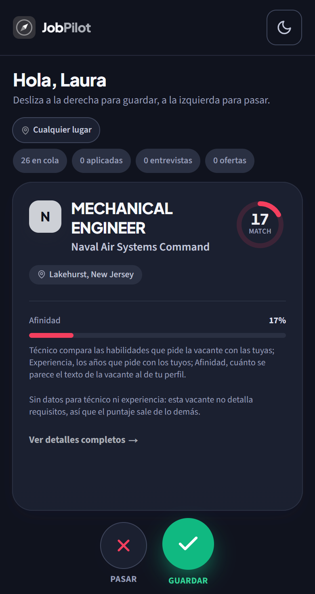
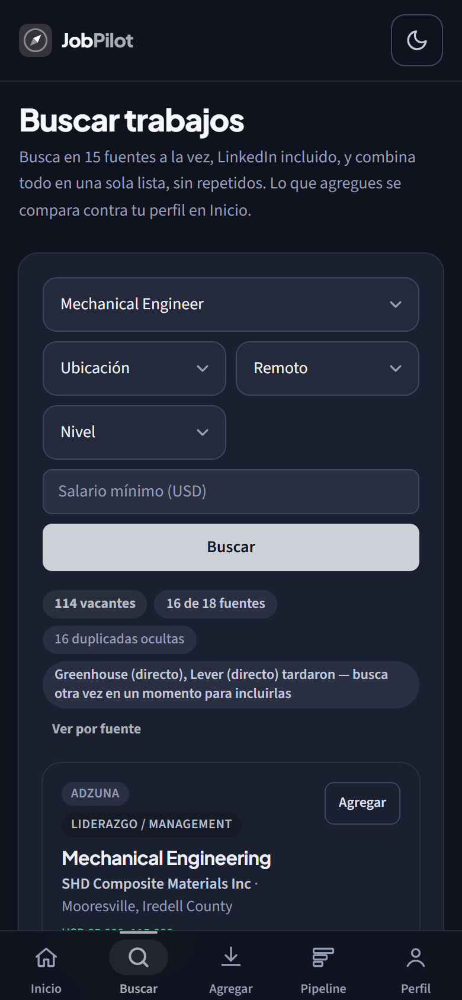
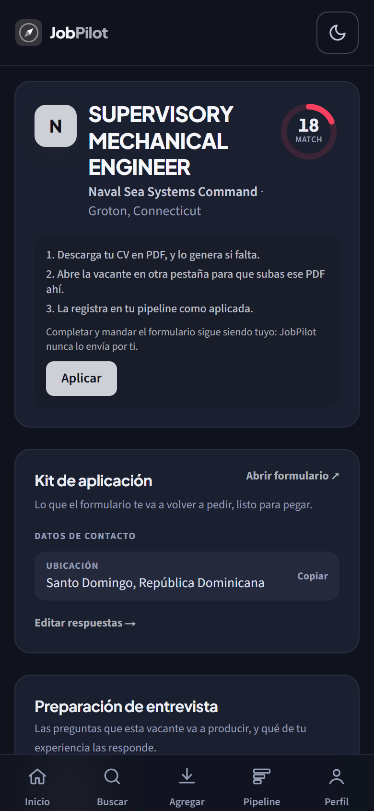
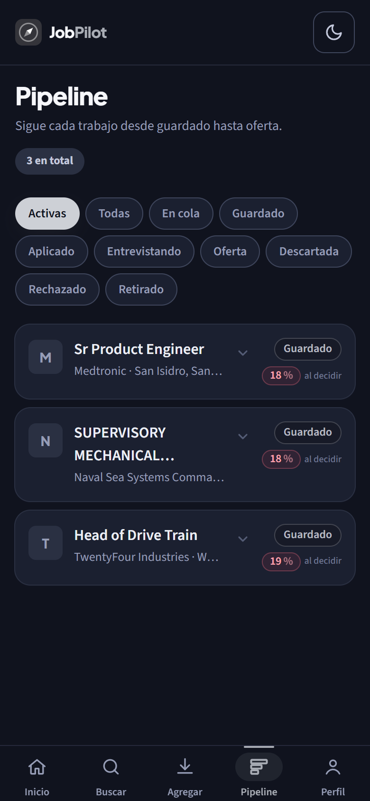
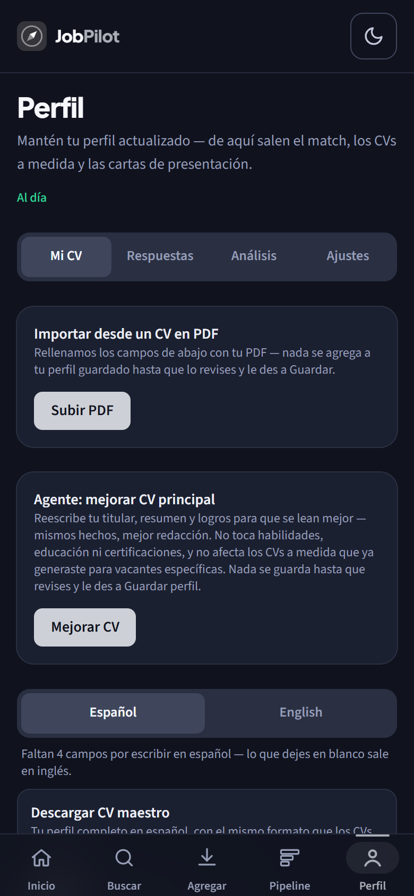
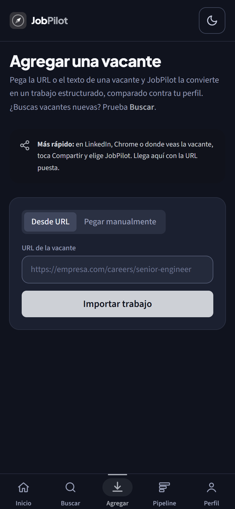
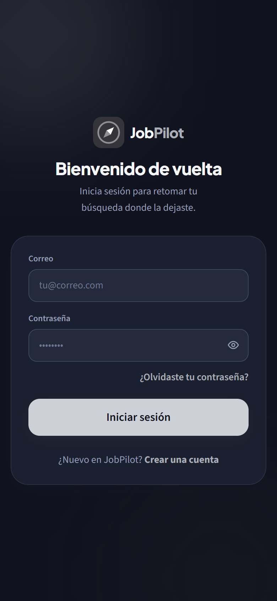

# JobPilot

**Tu asistente personal para buscar trabajo y postularte, desde el teléfono.**

Busca en 15 bolsas de empleo a la vez, te muestra qué tanto encaja cada vacante con tu CV
y te deja decidir con un swipe. Tú postulas; JobPilot te ahorra todo lo repetitivo.

[**Descargar para Android**](https://github.com/JuanAlfonso11/japlication/releases/latest)

---

## Cómo se ve

<table>
  <tr>
    <td align="center" width="25%"> <b>Inicio</b> · desliza para guardar o pasar</td>
    <td align="center" width="25%"> <b>Buscar</b> · 15 fuentes a la vez, según tu CV</td>
    <td align="center" width="25%"> <b>Vacante</b> · match, kit de aplicación y entrevista</td>
    <td align="center" width="25%"> <b>Pipeline</b> · de guardado a oferta</td>
  </tr>
  <tr>
    <td align="center"> <b>Perfil</b> · tu CV maestro, importado desde PDF</td>
    <td align="center"> <b>Agregar</b> · pega o comparte cualquier vacante</td>
    <td align="center"> <b>Tu cuenta</b> · privada, con recuperación por correo</td>
    <td></td>
  </tr>
</table>

Capturas de una cuenta de ejemplo (una ingeniera mecánica ficticia): todas las vacantes que la app le trae son de su área.

## Qué hace

### Encuentra vacantes que son para ti
- **15 fuentes en una sola búsqueda**, LinkedIn incluido, sin repetidos.
- **Se adapta a tu CV**: si eres médico te trae medicina, si eres ingeniero mecánico te trae
  ingeniería mecánica. Los puestos sugeridos salen de tu propio CV.
- **Vacantes nuevas cada 2 horas** en tu Inicio, con una notificación cuando llegan.
- **Agrega cualquier vacante** pegando su enlace o compartiéndola desde LinkedIn o Chrome
  (Compartir → JobPilot).

### Decide rápido
- **Swipe**: a la derecha guardas, a la izquierda pasas.
- **Puntaje de match** de cada vacante con tu perfil, explicado: habilidades que coinciden,
  las que te faltan, y años de experiencia que pide contra los tuyos.
- **Avisos útiles**: fecha límite, si la vacante sigue abierta y si pide un permiso de trabajo
  que no tienes.

### Postula sin volver a escribir lo mismo
- **CV maestro** importado desde tu PDF, en español e inglés.
- **CV y carta de presentación a medida** de cada vacante, generados a partir de lo que *tú*
  escribiste: nunca inventa experiencia.
- **Kit de aplicación**: tus datos y las respuestas a las preguntas de siempre (autorización de
  trabajo, preaviso, salario), cada una con un botón de copiar.
- **Preparación de entrevista** con las preguntas que esa vacante va a producir.
- **Revisión ATS** de tu CV y evaluación con sugerencias.

### Sigue todo en un solo lugar
- **Pipeline**: guardado → aplicado → entrevista → oferta.
- **Recordatorios** de las postulaciones que llevan tiempo sin respuesta.
- **Qué te falta para subir tu puntaje**, sumado sobre las vacantes que quisiste.

> JobPilot **no postula por ti**. Los bots de "auto-apply" responden en tu nombre cosas que
> nunca dijiste; aquí el texto lo escribes tú y la app solo evita que lo escribas dos veces.

## Instalación (Android)

1. Descarga el APK más reciente desde
   [**Releases**](https://github.com/JuanAlfonso11/japlication/releases/latest).
2. Ábrelo en el teléfono y permite instalar apps de esa fuente si Android lo pide.
3. Crea tu cuenta con tu correo y confírmala desde el correo que te llega.
4. Sube tu CV en PDF en **Perfil**. Desde ahí la app ya sabe qué buscarte.

La app se actualiza sola: cuando hay versión nueva aparece un aviso para instalarla.

## Tu cuenta y tus datos

- Cada cuenta es privada: nadie más ve tu perfil, tus CVs ni tus postulaciones.
- ¿Olvidaste tu contraseña? Te llega un enlace por correo que abre la app directamente.
- Contraseñas guardadas con bcrypt (nunca en texto plano), sesiones que se cierran en todos tus
  dispositivos al cambiarla y bloqueo tras varios intentos fallidos.

---

Hecho con Next.js, FastAPI y PostgreSQL. App Android con Capacitor.
